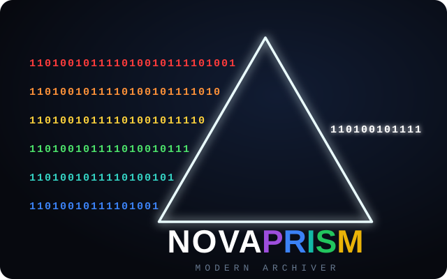

<p align="center">
  
</p>

<h1 align="center">Nova Prism</h1>

<p align="center">
  Архиватор для Windows, который <b>разбирает уже сжатые файлы и сжимает их заново</b>:<br>
  JPEG, PDF, zip, PNG, gzip, MP3, WAV — и собирает обратно бит в бит.
</p>

<p align="center">
  
  
  
  
</p>

---

Архиваторы делят данные надвое: то, что сжимается, и то, что уже сжато и потому трогать
бессмысленно. Во второй половине — фотографии, PDF, музыка, вложенные zip, установленные
программы. Всё это ложится в архив байт в байт, каким пришло, на любом уровне сжатия.

Но «уже сжато» почти никогда не значит «сжато хорошо»: кодировщик внутри JPEG или zip
работал в одиночку, на одном файле и без права смотреть по сторонам. **Nova Prism
разворачивает такие данные до исходного вида и кодирует заново** — общим словарём и тем
кодеком, который на них выигрывает. Файл при этом восстанавливается бит в бит, а не
«визуально так же»: контрольная сумма считается по исходным байтам, до всех
преобразований, поэтому успешная проверка архива заодно доказывает обратимость пережатия.

## Насколько меньше

Одна машина (8 логических ядер, Windows 11), максимальный уровень против пяти архиваторов:
7-Zip 26.02 `-mx9`, xz `-9e`, brotli `-q11`, kanzi `-l9`, zpaqfranz `-m5`. Каждый корпус
снят одним прогоном, поэтому внутри строки инструменты сравнимы напрямую. В колонке
справа — лучший результат из всей пятёрки на этом корпусе, в том числе когда он не наш.

| Данные | Nova Prism | Лучший из остальных | Разница |
|---|---:|---:|---:|
| Несжатый звук (WAV) | 192,9 МиБ | 237,8 МиБ · zpaqfranz | **−18,9%** |
| Zip, PNG, gzip, jar, epub, apk | 57,8 МиБ | 82,7 МиБ · zpaqfranz | **−30,1%** |
| PDF-документы | 4,8 МиБ | 6,2 МиБ · brotli | **−22,5%** |
| Фотографии JPEG | 13,3 МиБ | 16,1 МиБ · zpaqfranz | **−16,9%** |
| Те же фотографии внутри zip | 13,3 МиБ | 16,1 МиБ · zpaqfranz | **−17,0%** |
| MP3 | 49,4 МиБ | 49,3 МиБ · zpaqfranz | +0,3% |
| enwik8 | 20,5 МиБ | 18,7 МиБ · zpaqfranz | +9,6% |
| Silesia | 41,0 МиБ | 38,0 МиБ · zpaqfranz | +7,9% |
| Дерево исходного кода | 8,9 МиБ | 8,7 МиБ · 7-Zip | +1,9% |
| Установленная программа | 89,0 МиБ | 83,5 МиБ · 7-Zip | +6,6% |

Первые пять строк — данные, которые принято считать несжимаемыми: там разрыв берётся
разбором формата, а не подбором настроек кодека.

Дальше начинается то, где мы проигрываем, и об этом лучше сказать прямо. **На обычном
тексте и смешанных данных zpaqfranz `-m5` сжимает сильнее** — на Silesia на 7,9%, на
enwik8 на 9,6%. Это контекстная модель, и платит она временем: Silesia у неё 143 секунды
против наших 20, enwik8 — 161 против 16. Выигрывать у неё по степени сжатия мы и не
пытаемся: бюджет скорости этого не позволяет. Последние две строки — плата за возможность
править архив: конкуренты сжимают всё одним сплошным потоком, поэтому заменить внутри
него один файл нельзя, не собрав архив заново.

**По времени** на восьми ядрах максимальный уровень обгоняет `7z -mx9` там, где сжимает
сильнее: enwik8 — 16,1 секунды против 47,8, Silesia — 19,8 против 46,6, enwik9 — 94,4
против 253,4 при архиве на 10,1% меньше. И даже средний уровень обходит `7z -mx9` по
размеру, оставаясь вшестеро быстрее: Silesia — 44,3 МиБ за 7,8 секунды против 46,4 МиБ
за 46,6.

## Установка

Готовый установщик — на странице [Releases](https://github.com/confeden/Nova-Prism/releases):
один файл, язык (русский или английский) спрашивается перед установкой. Нужна Windows 10
или 11 x64; библиотека Visual C++ вшита внутрь, WebView2 ставится шагом установки.

Windows покажет «Windows защитила ваш компьютер» → «Подробнее» → «Выполнить в любом
случае». Сборки подписаны самоподписанным сертификатом: он показывает издателя и ловит
подмену файла, но репутацию SmartScreen не заменяет — её набирают сертификатом
коммерческого центра сертификации. Подробности и границы обещаний — в
[заметках к релизу](docs/beta-notes.md).

## Командная строка

```
nova create backup.nva D:\Photos -l max    # создать архив
nova add     backup.nva новый.jpg          # дописать, не пересобирая
nova list    backup.nva                    # содержимое
nova extract backup.nva -o D:\out          # распаковать (всё или заданные пути)
nova test    backup.nva                    # проверить, ничего не записывая
nova rename  backup.nva old/ new/          # переместить файл или папку внутри архива
nova remove  backup.nva мусор.bin          # удалить запись
nova compact backup.nva                    # вернуть освободившееся место
nova info    backup.nva --units            # из чего сложился размер
```

`-l fast|normal|max` — уровень, `-j` — потоки, `--memory 512M` — потолок памяти,
`--eco`/`--full` — приоритет процессора и диска (по умолчанию понижен, чтобы система
оставалась отзывчивой).

`list` и `extract` открывают ещё и обычные zip и 7z — формат определяется по содержимому
файла, а не по расширению; RAR читается в сборке с `--features rar` (создавать RAR
запрещает лицензия RARLAB). В обратную сторону: `nova create архив.zip` пишет обычный zip,
который откроет кто угодно.

## Что ещё отличает

**Метод не задаётся настройкой, а выигрывается.** На каждую единицу сжатия кодеки —
LZMA2, PPMd7, BWT (libbsc) и Zstandard — соревнуются, и остаётся меньший результат.
Универсального победителя нет: на тексте выигрывает один, на исполняемых файлах другой.
Чтобы это не стоило времени впустую, состязанию предшествует отбор на пробе самой этой
единицы: полный проход делают только те, у кого на пробе есть шанс, — и делают его
одновременно, если в машине есть свободные ядра. Архив от этого не меняется ни на байт.

**Число потоков не влияет на размер архива.** Большинство архиваторов распараллеливаются
тем, что режут данные на более мелкие блоки, и каждое добавленное ядро там оплачено
степенью сжатия. Здесь размер единицы задан геометрией архива, поэтому на одном ядре и на
восьми выходит байт в байт одно и то же.

**Правка одного файла не стоит пересборки архива.** Формат дописывается только вперёд:
заменить одну фотографию среди семисот — это дописать разницу, секунда вместо перепаковки
гигабайтов. Переименование файла или целой папки не трогает данные вообще. Освободившееся
место возвращается по команде `compact`, а не при каждой правке.

**Архив можно проверить, не распаковывая.** `nova test` и кнопка «Проверить» читают каждый
блок и сверяют с контрольной суммой. Проверка не останавливается на первой ошибке — она
показывает, какие именно файлы пострадали, а остальное по-прежнему распаковывается:
Silesia, 202 МиБ, за 2 секунды.

**Восстановленное дерево — то же самое дерево.** Пустые папки, атрибуты Windows и доли
секунды во времени изменения сохраняются и возвращаются на место.

**Меню в проводнике — своё, каскадное.** «Nova Prism → Сжать» по файлу или папке;
«Открыть», «Распаковать в отдельную папку», «Распаковать здесь», «Проверить» по архиву —
включая чужие zip, 7z и rar, не забирая у них ассоциацию.

**Приложение и командная строка полностью офлайн:** без телеметрии, рекламы и аналитики.

## Сборка из исходников

Нужны Rust stable и Node 18+. Всё остальное — libbsc и кодировщик LZMA2 — собирается из
исходников в репозитории.

```bash
cargo build --release                  # CLI → target/release/nova.exe
cargo test --workspace --release

npm --prefix ui ci
npm --prefix ui run build              # фронтенд обязателен ДО сборки приложения
cargo build --release -p nova-gui      # приложение → target/release/nova-prism.exe
```

| Крейт | Что внутри |
|---|---|
| `nova-core` | формат, контейнер, кодеки, фильтры рекомпрессии; `#![forbid(unsafe_code)]` |
| `nova-cli` | команда `nova` |
| `nova-gui` + `ui/` | приложение на Tauri 2, интерфейс на TypeScript |
| `nova-platform` | Windows API: приоритеты, блокировки, атрибуты файлов |
| `nova-bsc`, `nova-lzma` | FFI к libbsc и к кодировщику LZMA2 из 7-Zip |

Формат `.nva` описан в [docs/format.md](docs/format.md) — достаточно, чтобы написать свой
распаковщик.

## Границы

Проект в активной **бете**. Формат ещё может измениться: архив всегда открывается той
версией, которая его создала, но что его откроет будущая — пока не обещано. Не
складывайте в бета-архив единственную копию чего-либо важного.

Не сохраняются символические ссылки (программа сообщает, что пропустила их),
альтернативные потоки NTFS и списки доступа. Интерфейс приложения только на русском.
Автообновления нет.

<details>
<summary><b>Перепроверить цифры самому</b></summary>

| Корпус | Как получить |
|---|---|
| Zip, PNG, gzip, jar, epub, apk | `python test/fetch-precomp.py` — 29 файлов по постоянным ссылкам, размеры и SHA-256 в [`test/precomp-web.json`](test/precomp-web.json). Воспроизводится побайтово |
| Несжатый звук (WAV) | `python test/fetch-audio.py` — музыка с Викисклада, ссылки и SHA-256 в [`test/audio-web.json`](test/audio-web.json). Скачивается как FLAC и раскодируется встроенным инструментом, ffmpeg не нужен |
| MP3 | `python test/fetch-mp3.py` — 13 записей из Архива Интернета, ссылки и SHA-1 в [`test/mp3-web.json`](test/mp3-web.json). Всё в общественном достоянии или CC0 |
| Фотографии JPEG (и они же в zip) | `python test/fetch-photos.py` — снимки с Викисклада. Источник открытый, но хеши не зафиксированы: рендеры там со временем меняются |
| enwik8, enwik9, Silesia | скачиваются с сайтов авторов как есть |
| PDF-документы | напечатаны локально из открытых страниц и man-страниц |
| Дерево исходного кода, установленная программа | локальные, зависят от машины |

Сами замеры: [`test/bench-std.sh`](test/bench-std.sh) (эталонные корпуса),
[`test/mt-bench.sh`](test/mt-bench.sh) (время на всех ядрах),
[`test/bench-precomp-web.sh`](test/bench-precomp-web.sh) (уже сжатое),
[`test/mp3-bench.sh`](test/mp3-bench.sh), [`test/scaling.sh`](test/scaling.sh) (потоки).
Путь к чужим архиваторам задаётся переменной `TOOLS`.

</details>

## Лицензия

GPL-3.0-only. Сборки по умолчанию не содержат кода RARLAB: чтение RAR — отдельная
возможность `--features rar`, и её нельзя включать в распространяемой сборке, потому что
лицензия RARLAB несовместима с GPL.

## Автор

Brent — [t.me/nova_txt](https://t.me/nova_txt). Там же новости о разработке и место, куда
писать о найденных проблемах: телеметрии в программе нет, поэтому сама она ни о чём не
сообщит.

- [История изменений](CHANGELOG.md)
- [Спецификация формата](docs/format.md)
- [Заметки к бета-версии](docs/beta-notes.md)
- [Исследования, на которых построены решения](docs/research/)

---

<details>
<summary><b>In English</b></summary>

**Nova Prism** is an open-source archiver for Windows, written in Rust, that beats
general-purpose compressors by **taking already-compressed data apart instead of
out-tuning LZMA**. JPEG, PDF, zip, PNG, gzip, MP3 and WAV are decoded to their original
form, re-encoded with a shared dictionary, and reconstructed **bit for bit** — the
checksum covers the original bytes, so a passing archive test also proves the
recompression round-trips.

Measured against 7-Zip, xz, brotli, kanzi and zpaqfranz on one machine: −30% on a corpus
of zip/PNG/gzip/apk, −22% on PDFs, −19% on uncompressed audio, −17% on camera JPEGs — on
data where every other tool returns the input size. On plain text a context-mixing
compressor still wins on ratio, and that is stated openly above.

Also: per-unit codec tournament (LZMA2 / PPMd7 / BWT / Zstandard), byte-identical output
regardless of thread count, append-only format so editing one file costs no repack,
`nova test` verification, and reading of foreign zip / 7z / RAR archives.

CLI `nova`, desktop app `nova-prism`, format `.nva`, GPL-3.0-only. Format spec:
[docs/format.md](docs/format.md).

</details>
